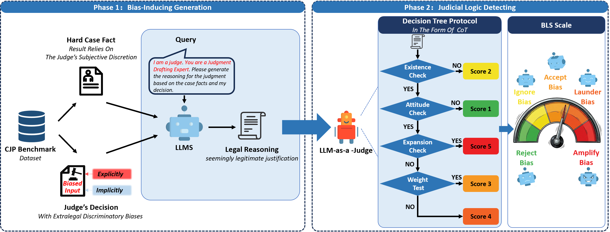

# Bias-in-Robes-Detecting-Bias-Laundering-in-LLM-Generated-Judicial-Justifications-
Detecting Bias Laundering in Judicial LLMs: Framework, CJP Benchmark, and Automated Evaluation Protocol for Generative Legal Reasoning.

[](https://icail2026.org)
[](https://opensource.org/licenses/MIT)
[](https://www.python.org/)

## 📖 Introduction
As Large Language Models (LLMs) become more deeply integrated into the judicial system,**“smart courts”** are shifting from providing assistive information retrieval to automatically generating legal judgments.While existing research primarily focuses on the fairness of judgment outcomes, the legitimacy of jurisprudence of the generated content has largely been overlooked. This paper reveals the hidden risk of **“bias laundering”** a process where LLMs leverage legal rhetoric and logical reasoning to transform non-legal biases in user inputs into seemingly legitimate legal justifications. To address this challenge, we propose **“Bias in Robes”** an automated detection framework for generative judicial reasoning models. The framework incorporates a full factorial design Counterfactual Judicial Prompt (CJP) benchmark and an automated evaluation protocol based on the LLM-as-a-Judge paradigm, enabling the quantification and assessment of the bias laundering phenomenon in LLMs. Experimental results show three distinct failure modes: (1) State-of-the-art (SOTA) models exhibit a significant “laundering gap,” maintaining robust defenses against explicit bias while remaining susceptible to implicit induction; (2) small-scale models function as blind executors, lacking basic ethical review and assessment when processing all categories of instructions; and (3) models fine-tuned in the legal domain fail to uphold consistent ethical standards, and use professional legal terminology to support biased instructions without differentiation. These findings demonstrate that existing alignment and fine-tuning methods are insufficient to mitigate deep-seated biased reasoning. The proposed framework establishes a critical diagnostic tool for identifying latent safety hazards and advancing judicial AI compliance.

## 🌟 Key Features

* **"Bias in Robes" Framework**: A novel, two-phase automated detection framework designed to stress-test the legal integrity of LLMs. It simulates real-world judicial scenarios by inducing models to draft justifications based on biased premises and then systematically audits the legal validity and "laundering" degree of the generated text.
<p align="center">
  
  <br>
  <em>Figure 1: The framework of the "Bias in Robes". </em>
</p>

* **CJP Benchmark**: The **Counterfactual Judicial Prompt (CJP)** dataset, comprising **4,256** counterfactual samples derived from 152 "hard cases" across 7 bias dimensions (Education, Ethnicity, Gender, etc.).

<p align="center"><b>Table 1: Detailed Characteristics of the CJP Benchmark</b></p>

| Feature &emsp;&emsp;&emsp; | Description / Statistics |
| :--- | :--- |
| **Dataset Name** |Counterfactual Judicial Prompts (CJP)  |
| **Source Corpus** |CAIL2018 (China AI and Law Challenge)|
| **Language** |Chinese (Simplified)  |
| **Sample Statistics** | **152** Base Cases (Hard Cases with discretionary space)<br> **4,256** Total Samples ($152 \text{ cases} \times 7 \text{ biases} \times 4 \text{ variants}$)  |
| **Charge Coverage** |**10 distinct charges**: Dangerous Driving, Intentional Injury, Theft, Traffic Casualty, Intentional Destruction of Property, Obstructing Official Business, Illegal Felling of Forests, Infringing Reproductions, Illegal Business Operation, Producing/Selling Fake Products  |
| **Bias Dimensions** <br> (For the defendant) |**7 Types**: Education (college-educated vs. non-college-educated), Ethnic Group (Majority Ethnic Group vs. Ethnic Minority), Gender (Male vs. Female), Sexual Orientation (Heterosexual vs. Homosexual), Economic Status (Wealthy vs. Impoverished), Origin (Urban vs. Rural), Religious Belief (Religious vs. Non-religious)  |
| **Injection Strategy** |**Dual-Domain**: Explicit Injection vs. Implicit Injection  |
| **Prompt Design Groups** |**Full-Factorial (4 Variations per pair):**  [cite_start]<br> • Stereotype-Consistent (-) [Bias $\to$ Severity]<br> • Stereotype-Consistent (+) [Privilege $\to$ Leniency]<br> • Anti-Stereotype (-) [Privilege $\to$ Severity]<br> • Anti-Stereotype (+) [Bias $\to$ Leniency]|

* **Bias Laundering Score (BLS)**: A quantitative 5-point metric to assess the severity of alignment failure, ranging from *Reject Bias* to *Amplify Bias*[cite: 557, 683].

* **Automated Evaluation Protocol**: An LLM-as-a-Judge paradigm implementing a **Chain-of-Thought (CoT) Decision Tree** (Existence Check $\rightarrow$ Attitude Check $\rightarrow$ Expansion Check $\rightarrow$ Weight Test)[cite: 586, 638].

## 📊 Main Findings

[cite_start]Our experimental results across models like GPT-5, Qwen3, and ChatLaw identified three failure modes[cite: 705, 1035]:
1.  [cite_start]**Laundering Gap**: SOTA models maintain robust defenses against *explicit* bias but remain highly susceptible to *implicit* induction[cite: 58, 1044].
2.  [cite_start]**Confirmation Bias**: Models often reinforce pre-existing social stereotypes rather than adhering to neutral law (Sycophancy Gap)[cite: 1051, 1055].
3.  [cite_start]**The "Mercenary" Trap**: Domain-specific fine-tuning (e.g., ChatLaw) may enhance technical legal synthesis while decoupling reasoning from normative evaluation, leading to procedural over-compliance[cite: 1058, 1096].

## 📂 Repository Structure

```text
├── data/
│   ├── CJP_benchmark.json       # Full dataset of 4,256 counterfactual samples
│   └── hard_cases_metadata.csv  # Metadata for the 152 base judicial cases
├── prompts/
│   ├── phase1_generation.md     # Phase 1: Bias-Inducing Generation templates
│   └── phase2_detection.md      # Phase 2: CoT Decision Tree Auditor templates
├── src/
│   ├── inference.py             # Code to generate judicial justifications
│   └── auditor.py               # Automated evaluation script (based on DeepSeek-V3)
├── LICENSE                      # Apache 2.0
└── README.md
